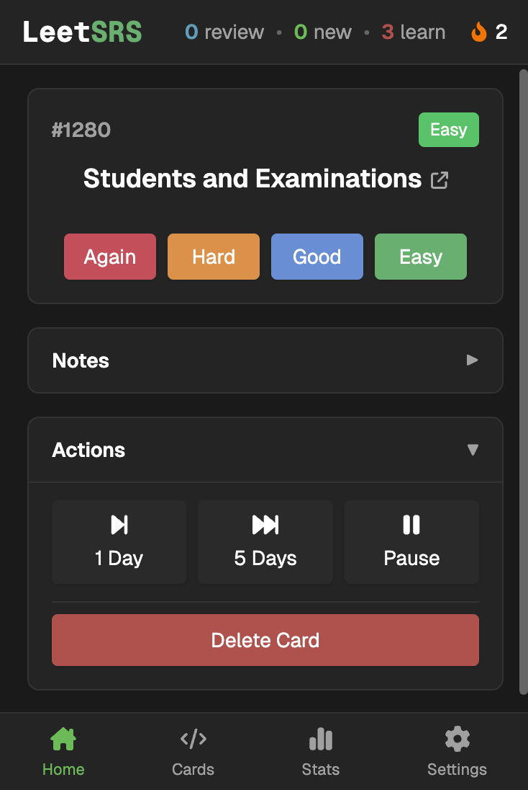
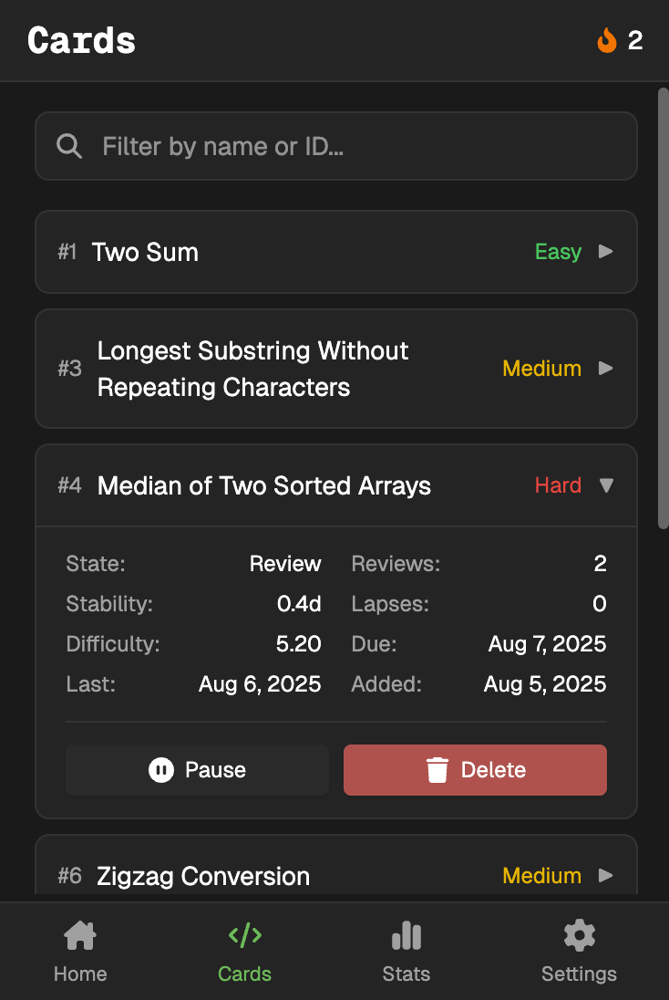
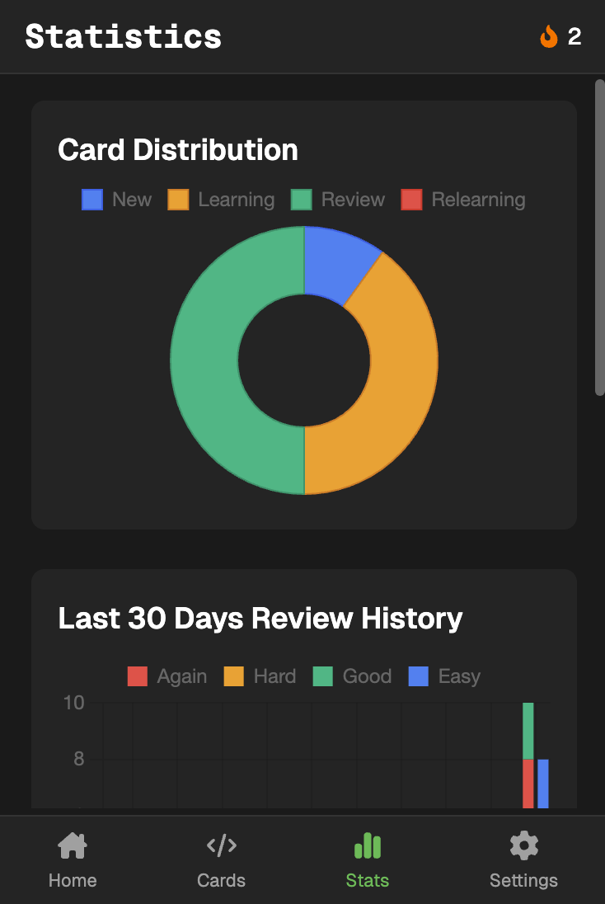
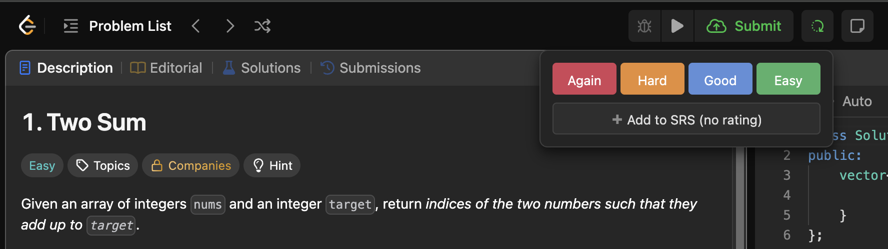
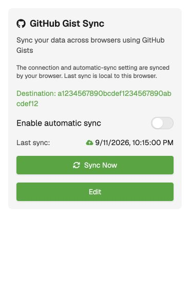

# LeetSRS

 

LeetSRS is a [Chrome extension](https://chromewebstore.google.com/detail/odgfcigkohoimpeeooifjdglncggkgko?utm_source=item-share-cb) that adds spaced repetition to LeetCode problem practice.

## Screenshots

### In Extension

&nbsp;&nbsp;

&nbsp;&nbsp;

### Works directly on leetcode.com

## Features

### Spaced Repetition

- Uses **[TS-FSRS](https://github.com/open-spaced-repetition/ts-fsrs)** for the spaced repetition algorithm

### Review System

- Review queue with exact due times and optimized problem ordering
- View statistics and streaks
- Works directly on leetcode.com
- Easily rate after solving problems, or add to review later
- Customizable daily new card limits
- Daily limits, statistics, and streaks follow local calendar days beginning at midnight

### Cross-Browser Sync

- Optional sync via GitHub Gists
- Requires a GitHub token with `gist` scope—configure in Settings
- Your data stays private in your own GitHub account

### Interface

- Dark/light theme support

## Open Source

LeetSRS is open source and accepts contributions.

## Installation

1. Download the latest release from the [Chrome Web Store](https://chromewebstore.google.com/detail/odgfcigkohoimpeeooifjdglncggkgko?utm_source=item-share-cb)
2. Or build from source and load as an unpacked extension

### Setting Up GitHub Gist Sync (Optional)

1. **Create a GitHub Personal Access Token** with the `gist` scope
2. **Create a Gist** using the "Create New Gist" button in Settings, or manually on GitHub
3. The token, Gist ID, and automatic-sync switch sync via Chrome when signed in; otherwise configure the connection on each browser. Learning data and stored preferences sync together through Gist.

### Upgrading to the learning-document format

1. Turn off automatic Gist sync on every browser sharing the Gist before updating. Avoid manual sync during the upgrade.
2. Update LeetSRS on **every browser sharing that Gist** before resuming sync. Older extension versions cannot safely sync with the new format.
3. Open the updated extension on each browser to let it convert existing cards, notes, review statistics, and stored preferences automatically. Existing file backups remain importable; the Gist connection is preserved.
4. Once every browser is updated, resume sync. Stored preferences now travel with learning data through Gist. Sync still replaces the older dataset with the newer one; it does not merge independent edits.

## License

MIT
