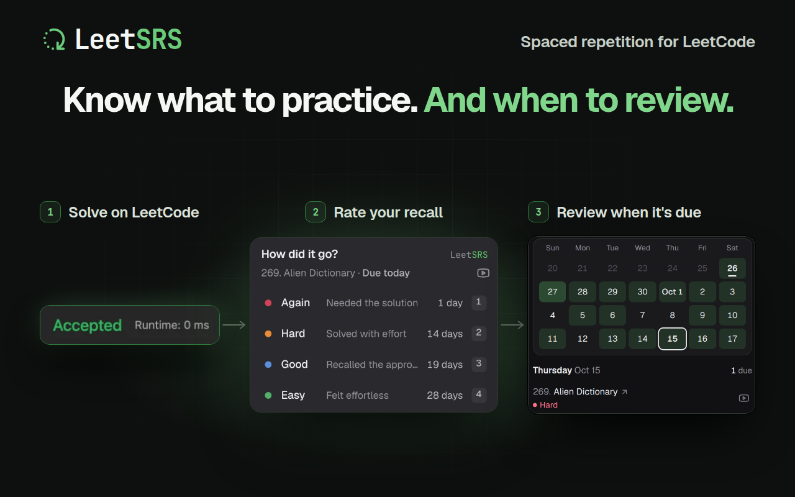

<p align="center">
  
</p>

LeetSRS is a Chrome extension that helps you remember what you learn on LeetCode through spaced repetition. Solve a problem, rate your recall, and review it when it's due. LeetSRS adjusts your review schedule based on your ratings. Follow a roadmap such as Blind 75 or NeetCode 150 for help choosing what to solve next. Your data stays local by default, with optional GitHub sync across devices. It's free and open source, and no LeetSRS account is required to get started.

<p align="center">
  <a href="https://chromewebstore.google.com/detail/odgfcigkohoimpeeooifjdglncggkgko">
    
  </a>
</p>

<p align="center">
  
</p>

## Get started

1. [Install LeetSRS from the Chrome Web Store](https://chromewebstore.google.com/detail/odgfcigkohoimpeeooifjdglncggkgko).
2. **Solve a problem.** Choose your own on LeetCode or follow a roadmap for suggestions.
3. **Rate your recall.** When your submission is accepted, the LeetSRS panel opens on the problem page. Choose **Again**, **Hard**, **Good**, or **Easy**, or press 1–4, to schedule your next review. Each rating shows when the problem will come back.
4. **Return for review.** Open LeetSRS: **Home** shows problems that are due, one at a time, and you can rate them right there. **Calendar** shows the next four weeks of reviews.

LeetSRS uses your ratings and review history with the [FSRS spaced repetition algorithm](https://github.com/open-spaced-repetition/ts-fsrs) to adjust your review schedule.

## Roadmaps

Choose **Blind 75**, **NeetCode 150**, **NeetCode 250**, or **Grind 75**. Track your progress and see your next suggested problem while previously rated problems stay in your review schedule. You can also add problems outside a roadmap.

Set a daily limit for new problems, pause individual problems, and track your streaks.

## Your data

Your practice data stays local by default. No LeetSRS account is required. Export a backup or import your data from Settings.

For optional sync across devices, connect GitHub and select a Gist in your own GitHub account. Signing in alone does not enable sync. New backups are secret Gists: anyone with the link can read them. See the [privacy policy](https://github.com/mattcdrake/LeetSRS/blob/main/PRIVACY.md) for details about storage and GitHub sign-in.

<details>
<summary>Set up GitHub sync</summary>

1. In Settings, under **GitHub Gist sync**, select **Sign in with GitHub**.
2. Choose an existing backup or **Create New Gist**, then select **Connect and sync**.
3. Repeat on each browser, selecting the same backup. Credentials and the selected backup stay local to each installation.

Turn off **Sync automatically** to pause syncing. **Sign out** removes the local connection and credentials while keeping your practice data and GitHub backups.

Sync uses the entire dataset from the browser with the newest edit; it does not merge individual problems. Concurrent changes on another computer can be lost. Sync runs after local edits, when the extension starts, and at least once per minute for retry while enabled.

</details>

## Development

Use Node.js 24 or newer. Clone the repository and install dependencies:

```sh
git clone https://github.com/mattcdrake/LeetSRS.git
cd LeetSRS
npm install
npm run dev
```

| Command                  | Purpose                                                                                                                                          |
| ------------------------ | ------------------------------------------------------------------------------------------------------------------------------------------------ |
| `npm run dev`            | Start Chrome with a fresh temporary profile.                                                                                                     |
| `npm run dev:persistent` | Reuse a Chrome profile, including logins and extension data.                                                                                     |
| `npm run dev:reset`      | Delete the persistent development profile, including its logins and extension data. Stop the dev server and close the development browser first. |
| `npm run build`          | Build the production extension.                                                                                                                  |
| `npm run zip`            | Package the extension for distribution.                                                                                                          |
| `npm run check`          | Run lint, formatting, type, and test checks.                                                                                                     |

The persistent profile lives in `.wxt/chrome-data`, which Git ignores. Fresh runs leave it untouched.

## Contributing

Bug reports, feedback, and contributions are welcome. [Open an issue](https://github.com/mattcdrake/LeetSRS/issues) or read the [contribution guidelines](https://github.com/mattcdrake/LeetSRS/blob/main/CONTRIBUTING.md) before opening a pull request.

## License

[MIT](https://github.com/mattcdrake/LeetSRS/blob/main/LICENSE.md)
