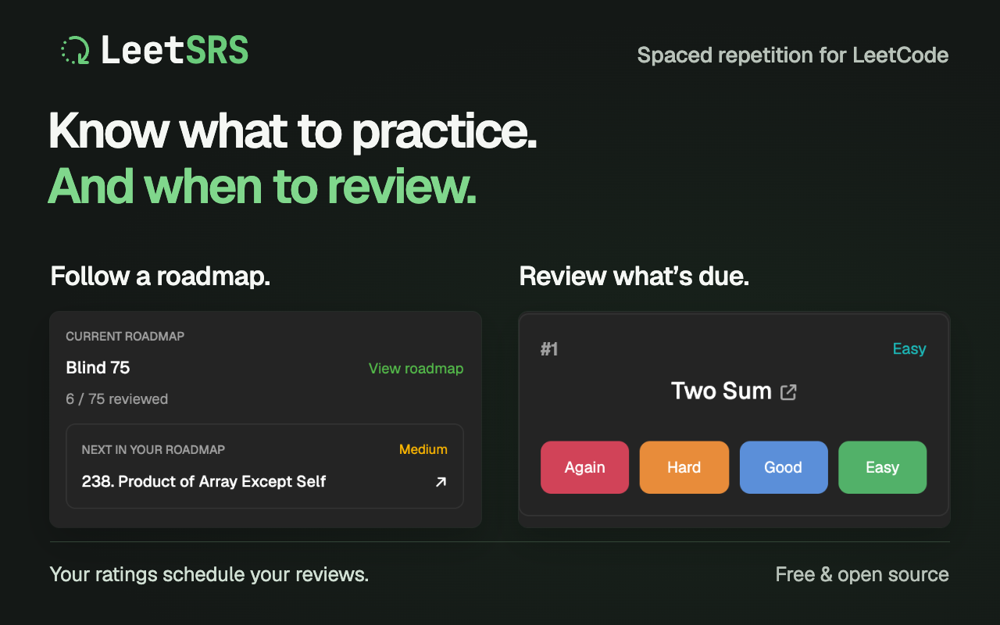
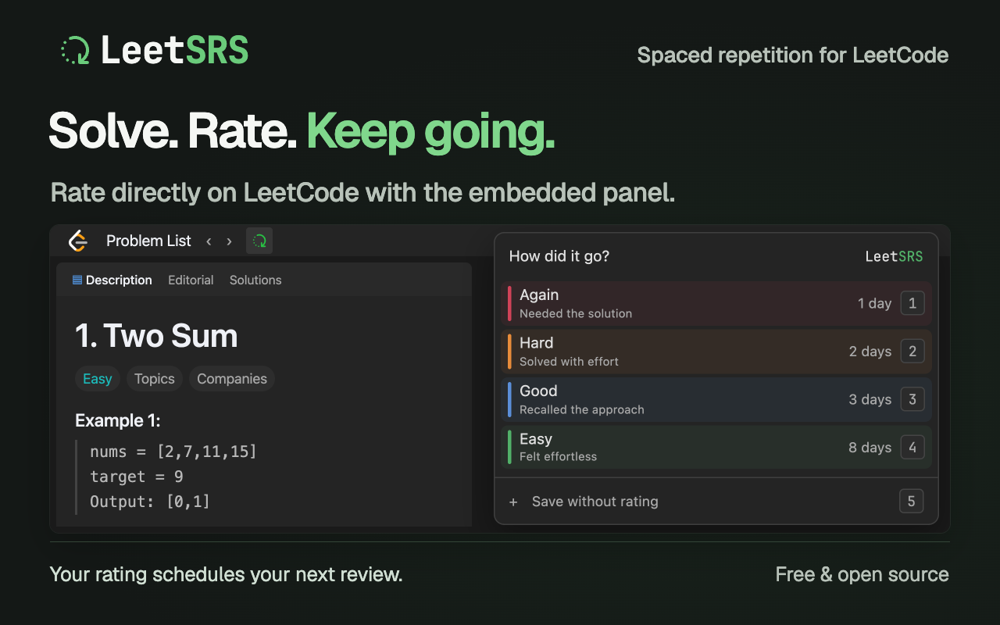
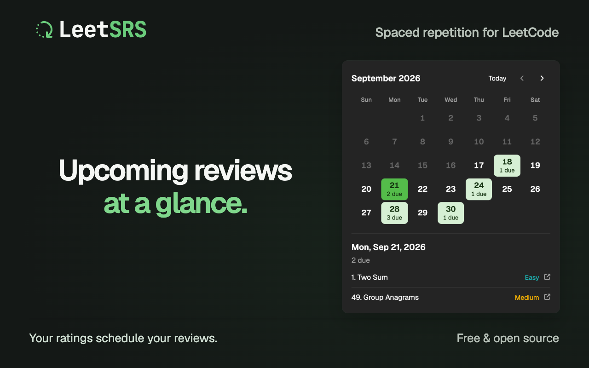

# LeetSRS

**Know what to practice—and when to review it.**

LeetSRS is a free, open-source Chrome extension that brings spaced repetition to your LeetCode practice. Work through interview roadmaps like Blind 75 or NeetCode 150 while keeping up with problems you've already solved.

Solving a problem once doesn't mean you'll remember how next time. LeetSRS uses your ratings to schedule reviews, so revisiting problems stays part of your interview preparation.

**[Add LeetSRS to Chrome](https://chromewebstore.google.com/detail/odgfcigkohoimpeeooifjdglncggkgko)** · [Privacy](PRIVACY.md) · [Changelog](CHANGELOG.md)

**[Watch the demo on YouTube](https://www.youtube.com/watch?v=AvE9a7tMS7w)**

## Follow a roadmap

Choose a roadmap, open your next problem, and track your progress without managing a separate spreadsheet. Your next new problem appears alongside the reviews that are due.

## Solve. Rate. Keep going.

Rate how each solve went directly on LeetCode: **Again**, **Hard**, **Good**, or **Easy**. LeetSRS uses your ratings and the [FSRS spaced repetition algorithm](https://github.com/open-spaced-repetition/ts-fsrs) to schedule your next review. You can also save a problem to review later without rating it.

## Review at your own pace

Open your review queue for what's due now, or check the calendar for upcoming reviews. Set a daily limit for new problems, pause individual problems, and track your streaks. Daily limits and streaks follow your local day, starting at midnight.

## Your practice. Your data.

Start without a LeetSRS account. Your practice data stays on your device by default, and you can import or export a backup from Settings whenever you want.

To continue on another computer, enable optional GitHub sync. Your backup lives in a Gist in your own GitHub account. See the [privacy policy](PRIVACY.md) for details.

Set up GitHub sync

1. Select **Sign in with GitHub** in Settings. Signing in alone does not enable sync.
2. Choose an existing backup or **Create New Gist**, then select **Connect and sync**.
3. Repeat on each browser, selecting the same backup. Credentials and the selected backup stay local to each installation.

Use the sync toggle to pause syncing. **Sign out** removes the local connection and credentials while keeping your practice data and GitHub backups.

Sync uses the entire dataset from the browser with the newest edit; it does not merge individual problems. Concurrent changes on another computer can be lost. Sync runs after local edits, when the extension starts, and at least once per minute for retry while enabled.

## Get started

1. [Install LeetSRS from the Chrome Web Store](https://chromewebstore.google.com/detail/odgfcigkohoimpeeooifjdglncggkgko).
2. Open the extension and choose a roadmap.
3. Solve your next problem on LeetCode and rate how it went. LeetSRS schedules the review.

## Setup

To build from source or contribute, use Node.js 24 or newer and install dependencies with `npm install`.

- `npm run dev`: start Chrome with a fresh temporary profile.
- `npm run dev:persistent`: reuse a Chrome profile, keeping logins and extension data between runs.
- `npm run dev:reset`: delete the persistent development profile, including its logins and extension data. Stop the dev server and close the development browser first.
- `npm run build`: build the production extension.
- `npm run zip`: package the extension for distribution.

The persistent profile lives in `.wxt/chrome-data`, which Git ignores. Fresh runs leave it untouched.

Bug reports, feedback, and contributions are welcome. Read the [contribution guidelines](CONTRIBUTING.md) before opening a pull request.

## License

[MIT](LICENSE.md)
