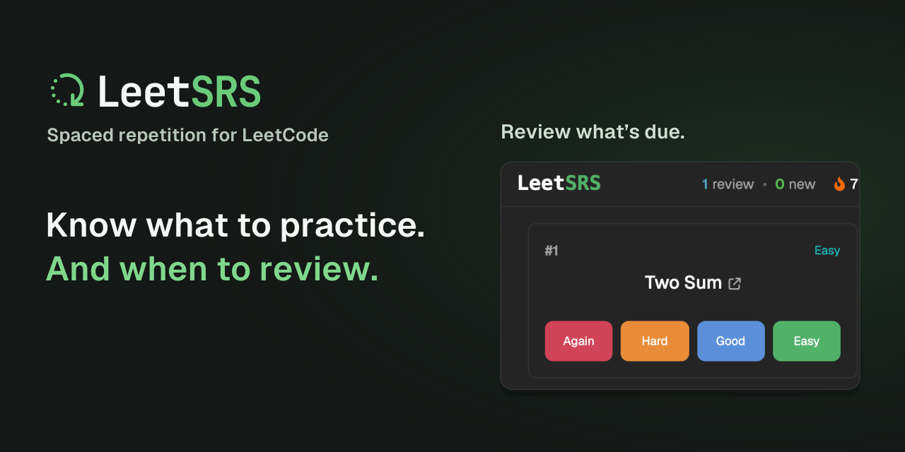

# Social preview assets

## GitHub repository preview

Upload [github-preview.png](github-preview.png) in the repository's **Settings → General → Social preview → Edit → Upload an image**. Adding the file to the repository does not activate it automatically.

The PNG is 1280 × 640 pixels and under 1 MB, matching [GitHub's recommended dimensions and file limit](https://docs.github.com/en/repositories/managing-your-repositorys-settings-and-features/customizing-your-repository/customizing-your-repositorys-social-media-preview).

## Source

[github-preview.svg](github-preview.svg) is the self-contained export source. It includes the existing logo and outlined typography, plus an embedded crop of the actual Home screenshot from the [landing repository](https://github.com/mattcdrake/LeetLanding/blob/main/assets/cws/v1.0/source/home.png). No external fonts or linked images are required to render it.

The screenshot shows one due review, Two Sum, and the Again, Hard, Good, and Easy ratings. The crop retains the original interface text and colors. The approved tagline is “Know what to practice. And when to review.”

The existing `leetsrs-preview.svg` and `leetsrs-preview.png` remain the 1200 × 630 logo-and-wordmark card.
