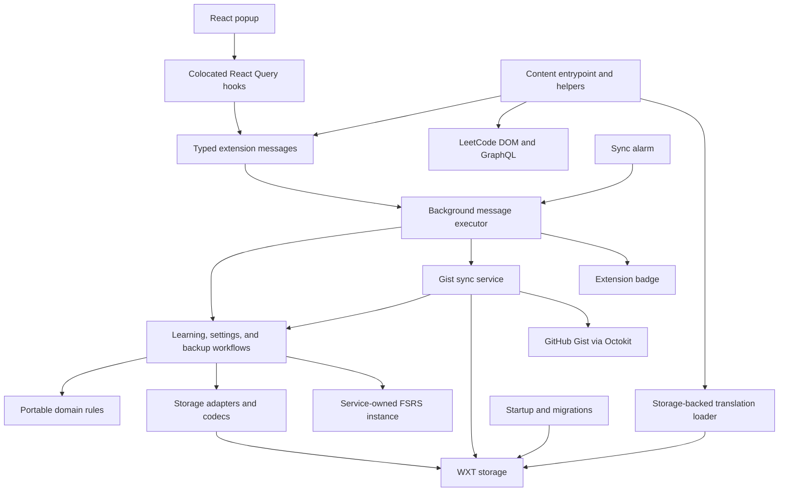

# LeetSRS architecture

This describes the checked-out implementation as of September 6, 2026, after
#237–#243 and #246. Remaining refactor work is #244, #245, and #247. The
[refactor checklist](plans/architecture-refactor.md) records implementation and
verification; the [roadmap](plans/roadmap.md) records subsequent work. The
[regional identity and catalog contract](regional-problem-identity.md) describes
planned behavior, not the current storage model.

## Current architecture

The popup and LeetCode content script send typed commands to one background
owner of learning-data mutations. Services coordinate portable domain rules and
storage adapters. Gist synchronization still owns its Octokit calls and direct
configuration/status storage access pending #244.

Arrows represent runtime calls or access. Shared contracts and domain types are
not separate processes.

| Area | Responsibility | Main files |
| --- | --- | --- |
| Popup | Views, forms, query hooks, cache invalidation | [popup](../entrypoints/popup/App.tsx), [queries](../entrypoints/popup/queries/cards.ts) |
| Content | DOM integration, GraphQL problem lookup, controls, editor reset | [entrypoint](../entrypoints/content.ts), [helpers](../content/index.ts) |
| Messaging/background | Public RPC contract, readiness, write serialization, sync/badge policy, alarms | [messages](../shared/messages.ts), [executor](../entrypoints/background/messaging.ts), [registry types](../entrypoints/background/registry-types.ts) |
| Domain | Review-day, scheduling, queue/statistics calculations, settings/note/import policy | [review queue](../domain/review-queue.ts), [settings policy](../domain/settings-policy.ts), [import policy](../domain/backup-import.ts) |
| Services | Clock/settings reads, FSRS lifetime, multi-entity workflows | [cards](../services/cards.ts), [settings](../services/settings.ts), [import/export](../services/import-export.ts) |
| Storage | Raw records, card/backup codecs, snapshot traversal, settings access, migrations | [cards](../infrastructure/storage/cards.ts), [snapshot](../infrastructure/storage/snapshot.ts), [backup codec](../infrastructure/storage/backup-codec.ts), [migrations](../infrastructure/storage/migrations.ts) |
| Language | Portable selection/dictionaries, browser detection, stored-language loading | [selection](../shared/i18n/language.ts), [browser adapter](../infrastructure/browser/language.ts), [loader](../infrastructure/storage/translations.ts) |
| Gist sync | Whole-snapshot comparison, backup reuse, Octokit requests, sync configuration/status | [sync service](../services/github-sync.ts) |

### Ownership and dependencies

- `domain/` owns portable models and rules. It must not import React, WXT, DOM
  integration, storage, or messaging, including storage-only types.
- `services/` owns workflows, clock/settings reads, and cross-entity side-effect
  order. Infrastructure must not import services or UI.
- `infrastructure/storage/` owns storage keys and persisted representations.
  Learning workflows retain raw card records privately and decode only requested
  cards. Stats and editor-reset projections read through card persistence, so
  there is no cards/statistics service cycle.
- Backup payload contracts and JSON conversion belong in
  `infrastructure/storage/backup-codec.ts`. Structure/schema acceptance, shallow
  validation, and legacy settings conversion belong in `domain/backup-import.ts`.
  The domain policy passes record contents through generic parameters without
  importing `StoredCard`. Purity or reuse alone does not determine ownership.
- `shared/` owns public messages, sync contracts, and translations. Background-only
  registry policy types live beside the executor. Shared code must not import
  services or concrete storage adapters.
- Popup hooks and queries live beside the popup. Popup/content commands use typed
  messages. Content language loading retains its explicit read-only storage
  adapter; it does not go through messaging.

### Learning and settings flows

**Rate a problem:** the executor waits for startup and preceding writes. The card
service loads cards, runs its FSRS instance, writes the card, then updates daily
stats and calculates `shouldRequeue`. The executor marks the local edit and
refreshes the badge. Popup mutations then invalidate their queries.

**Review queue:** services read cards, settings, and statistics; domain rules
partition eligibility using explicit dates and `dayStartHour`, apply the remaining
new-card allowance, and sort. Partitioning precedes the statistics read; limiting
and final sorting follow it. Services retain separate clock/settings reads,
including conditional today/yesterday reads in statistics.

**Settings:** domain policy defines defaults and validation; infrastructure owns
WXT access. The service retains concurrent reads/writes and sync timestamp
tracking. Each invalid read resolves its fallback independently, including browser
language detection. Export omits invalid settings instead of resolving defaults.
Failed concurrent writes may leave partial state without marking the local edit.

### Persistence and backup flows

Cards are slug-keyed records with UUID IDs; notes use those UUIDs and stats use
date keys. Settings have individual keys. `StoredCard` encodes dates as numbers;
learning reads restore `Date` objects. Storage schema changes use sequential
migrations.

**Export:** the service reads raw cards, stats, and card-associated notes, then
settings, Gist metadata, the data timestamp, and schema version. It samples the
export clock last and serializes pretty JSON. The payload preserves raw fields
and includes settings and some Gist configuration, but excludes the PAT and
orphan notes.

**Import:** JSON parsing and structure validation precede the schema read.
Compatibility and shallow record/settings validation follow it; a missing data
timestamp is generated afterward. The service saves the existing PAT, resets,
restores a truthy PAT, then writes cards, stats, whole notes, settings, Gist
configuration, and the imported timestamp. Settings can write an intermediate
local timestamp before the imported timestamp replaces it.

**Reset:** the service loads cards before removing cards, stats, settings, sync
credentials/status, and the data timestamp, then deletes notes referenced by the
loaded cards. Schema version and orphan notes remain. Snapshot helpers perform
raw access and sequential note traversal; services retain inclusion decisions,
PAT handling, and cross-entity order. Helpers do not mark local edits.

**Sync:** popup requests and the one-minute alarm use the same write executor.
Gist sync compares whole-dataset `dataUpdatedAt` timestamps, pushes an export or
pulls through import, and updates sync status. Network work stays inside the
serialized write operation. There is no per-card merge.

## Remaining refactor work

The behavior-preserving refactor in #236 must finish before correctness and
feature work resumes. Completed extractions are recorded in the
[checklist](plans/architecture-refactor.md), rather than listed as open findings here.

| Issue | Remaining work |
| --- | --- |
| #244 | Extract Octokit transport and sync configuration/status storage. Reconcile metadata access already in `snapshot.ts`; preserve service-owned PAT/timestamp policy and network queue scope. |
| #245 | Move content mounting/orchestration out of the WXT entrypoint, preserving calls and lifecycle. Language adapters are already separated. |
| #247 | Enforce runtime and type-only dependency boundaries, finish documentation, compare compatibility fixtures/builds, and resolve required extension smoke-test gaps. |

The #243 checks passed with 67 files and 690 tests, and its production build
passed. Only the background bundle changed from the final extraction baseline;
manifest permissions, entrypoints, popup, content, and other assets were unchanged.
Browser testing was not performed for #243. This does not complete #247's broader
compatibility verification.

## Remaining behavior gaps

These require behavior changes and remain outside the architectural extractions.
The [roadmap](plans/roadmap.md) records their dependencies and acceptance criteria.

| Gap in current behavior | Follow-up |
| --- | --- |
| Writes are serialized, but reads can observe intermediate state. Rating/import/reset can fail after partial writes; a badge failure can reject an otherwise persisted mutation. | #213; badge ownership in #163 |
| Services sample clocks/settings at multiple points rather than using one consistent operation snapshot. | #218 |
| Import validates containers/settings rather than individual records. Legacy imports do not share sequential startup migrations, and startup continues after migration failure. | #214 |
| Backup and sync share settings/Gist configuration; whole-snapshot last-write-wins can discard unrelated edits. Network calls occupy the write queue. | #215 |
| Popup invalidation follows its own mutations; content and alarm changes have no general background-to-popup notification contract. | #219 |
| Public card message types contain `Date` values without an explicit wire codec; some consumers reconstruct dates defensively. | #220 |
| The content entrypoint owns mounting, and existing cleanup/navigation behavior can leave stale operations. Bootstrap extraction alone will not fix lifecycle behavior. | #216, after #245 |
| Application errors are not consistently translated; GitHub requests lack explicit timeouts and uncertain-write recovery. | #248, #249 |

Catalog-backed string frontend IDs, payload separation, and catalog migration are
planned in the [identity contract](regional-problem-identity.md) and roadmap. The
current extension still uses slug-based operations and UUID note references.
